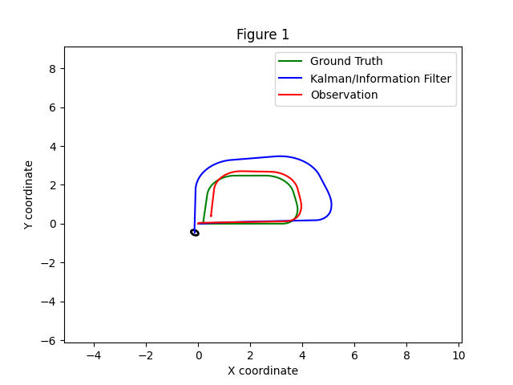
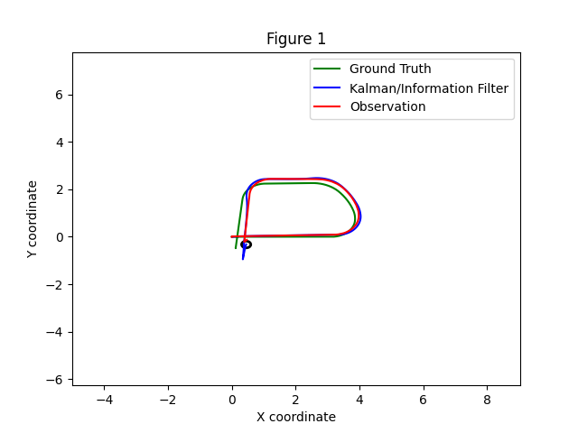
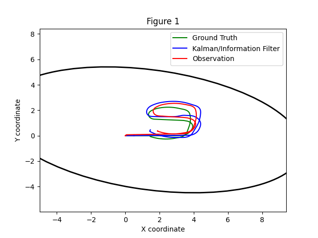
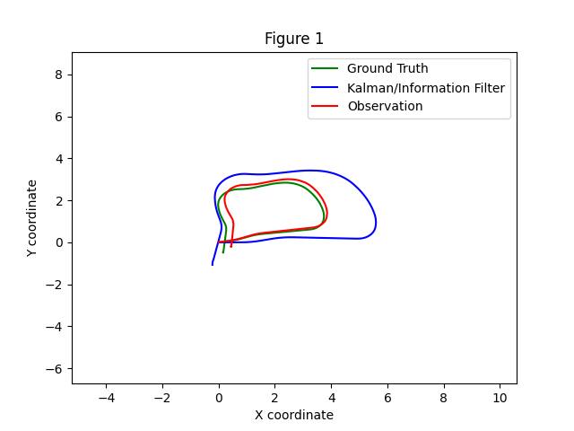
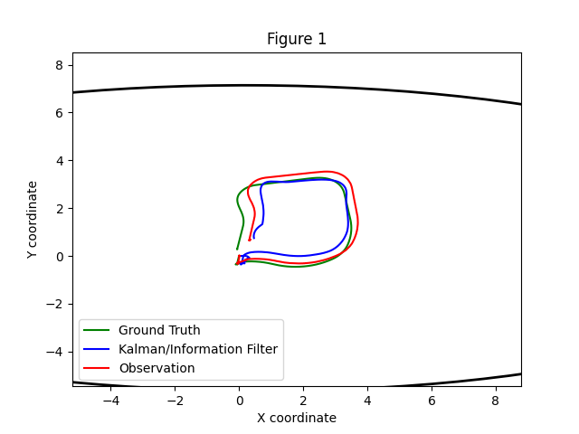
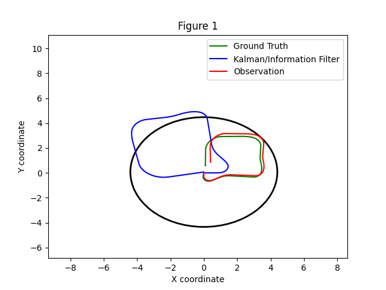
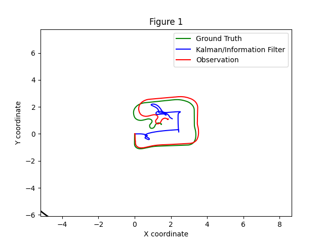

# p3_adr_mtg

## Overview
Un paquete de ROS2 que aplica filtos de Kalman extendidos (3D, 7D y 8D) a Turtlebot3 en Gazebo para comparar los modelos.

## Features
- 3D, 7D, y 8D EKF variantes  
- "Plug-and-play" modelos de movimiento y observación 

## Explicaciones

## Comparación 3D base y con más ruido en la obvervación y en el modelo de movimiento
Para todos los casos del ruido lo que se ha hecho es aumentar en 1 orden de magnitud todas las componentes.

### 3D base

### 3D ruido observación

### 3D ruido modelo

En general el modelo 3D funciona bien, sobre todo en cuanto a la incertidumbre se refiere, siendo el radio de esta muy pequeña. Por otro lado, vemos que, como es lógico, en el modelo base y con ruido en la observación, la diferencia entre el filtro/la observación y el "ground truth" es bastante visible. Sin embargo, cuando solo añadimos ruido en el modelo de movimiento, todo mejora, siendo muy parecidas las trayectorias entre las 3 medidas, siendo esto porque con este ruido el filtro "aprende" más rápido, es decir, sabe ajustarse mejor.

### 7D base

### 7D ruido observación

### 7D ruido modelo


### 8D base

### 8D ruido observación

### 8D ruido modelo


## Folder Structure
```
p3_adr_mtg/
├── LICENSE
├── package.xml
├── setup.py
├── p3_adr_mtg/
│   └── filters/ekf.py
├── test/
└── images/
    ├── state_evolution.png
    └── covariance_heatmap.png
```

## Contributing
Please file issues or pull requests via the project’s GitHub page.

## License
Apache-2.0 (see LICENSE)
