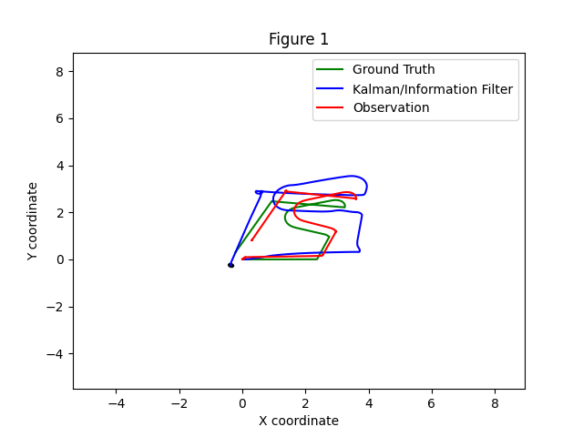

# p3_adr_mtg

## Overview
Un paquete de ROS2 que aplica filtos de Kalman extendidos (3D, 7D y 8D) a Turtlebot3 en Gazebo para comparar los modelos.

## Features
- 3D, 7D, y 8D EKF variantes  
- "Plug-and-play" modelos de movimiento y observación 

## Usage

### Visualizing Results


## Folder Structure
```
p3_adr_mtg/
├── LICENSE
├── package.xml
├── setup.py
├── p3_adr_mtg/
│   └── filters/ekf.py
├── test/
└── images/
    ├── state_evolution.png
    └── covariance_heatmap.png
```

## Contributing
Please file issues or pull requests via the project’s GitHub page.

## License
Apache-2.0 (see LICENSE)
