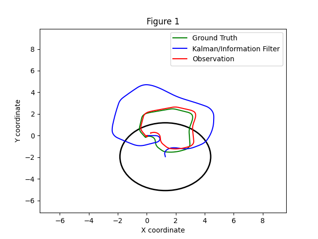

# p3_adr_mtg

## Overview
Un paquete de ROS2 que aplica filtos de Kalman extendidos (3D, 7D y 8D) a Turtlebot3 en Gazebo para comparar los modelos.

## Features
- 3D, 7D, y 8D EKF variantes  
- "Plug-and-play" modelos de movimiento y observación 

## Explicaciones

## Comparación 3D base y con más ruido en la obvervación y en el modelo de movimiento
Para todos los casos del ruido lo que se ha hecho es aumentar en 1 orden de magnitud todas las componentes.

### 3D base

### 3D ruido observación

### 3D ruido modelo

En general el modelo 3D funciona bien, sobre todo en cuanto a la incertidumbre se refiere, siendo el radio de esta muy pequeña. Por otro lado, vemos que, como es lógico, en el modelo base y con ruido en la observación, la diferencia entre el filtro/la observación y el "ground truth" es bastante visible. Sin embargo, cuando solo añadimos ruido en el modelo de movimiento, todo mejora, siendo muy parecidas las trayectorias entre las 3 medidas, siendo esto porque con este ruido el filtro "aprende" más rápido, es decir, sabe ajustarse mejor.

### 7D base

### 7D ruido observación

### 7D ruido modelo

En el caso 7D donde entran las velocidades y la aceleración lineal, vemos que en general la predicción es bastante aproximada a la posición real, excepto con más ruido en la observación, donde difiere un poco más. Por otro lado, donse sí se ve un mayor efecto por el ruido como es lógico en parte, es en la incertidumbre (elipse negra), que en el caso base es de un tamaño medio (pduiéndose mejorar el modelo seguramente), con ruido en el modelo de movimiento es bastante grande y finalmente con ruido en la observación es tan grande que se sale de la gráfica.

### 8D base

### 8D ruido observación

### 8D ruido modelo

Por último, en el caso 8D, donde se tratan por separado las componentes x e y de la velocidad lineal, el filtro parece comportarse de manera algo extraña:
- En el caso base la incertidumbre es más o menos aceptable pero la predicción difiere "bastante" del "ground truth".
- Al meter más ruido en la observación, la incertidumbre se mantiene pero la predicción es muy mala, principalmente porque está rotada unos 90º respecto al "ground truth".
- Al meter más ruido en el modelo de movimiento, la predicción sigue difiriendo, pero lo que más llama la atención es la incertidumbre, que se hace excesivamente grande.
